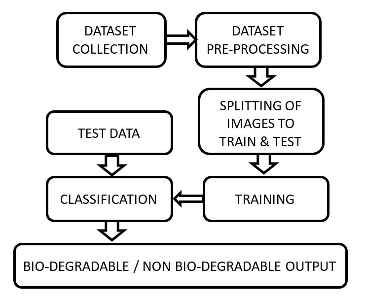
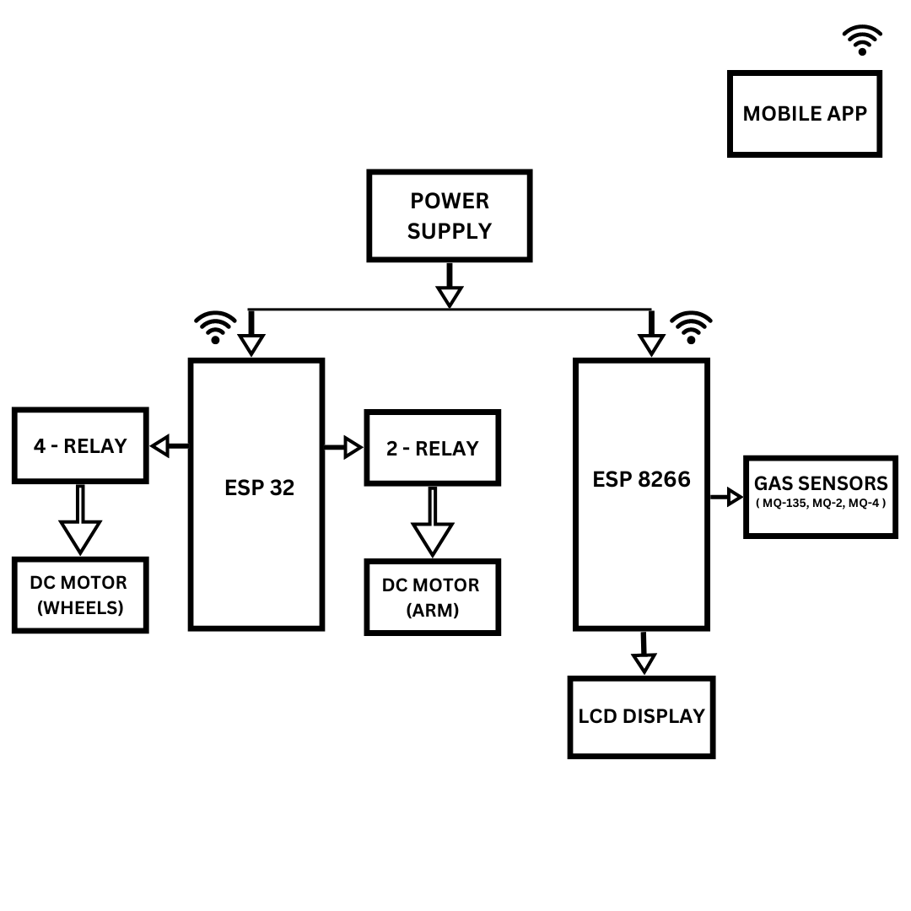

# Underground Sewage Cleaning Robot

## Overview
This project involves the design and development of an **Underground Sewage Cleaning Robot** that utilizes **ESP32** and **ESP8266** microcontrollers, integrating relay-controlled motors for precise arm and wheel movements, alongside gas sensors for real-time atmospheric monitoring. The robot is equipped with a waste type detection system using image processing and machine learning, allowing it to classify and segregate biodegradable and non-biodegradable waste materials. The robot enhances safety and efficiency in sewage maintenance processes by providing real-time feedback through a mobile application.

## Key Features
- **Real-Time Monitoring**: Gas sensors detect atmospheric conditions in the sewage environment.
- **IoT Connectivity**: ESP32 and ESP8266 modules enable wireless data transmission to a mobile app for remote control and monitoring.
- **Waste Classification**: Machine learning algorithms are used for waste type detection and classification.
- **Precision Control**: Relay-controlled motors manage the movement of wheels and the robotic arm.
- **Safety**: The robot includes a camera for remote visual feedback and gas detection sensors to ensure operational safety.

## Components Used
- **ESP32**: Primary microcontroller handling motor control and data transmission.
- **ESP8266**: Secondary microcontroller connected to gas sensors and the LCD display.
- **Relays**: 4-relay module for wheel control and 2-relay module for arm control.
- **Gas Sensors**: MQ-135, MQ-2, and MQ-4 sensors for detecting various gases.
- **DC Motors**: For moving the robot and controlling the robotic arm.
- **LCD Display**: Shows real-time sensor data.
- **Mobile Application**: Provides an interface for remote monitoring and control.
- **Camera**: Enables real-time visual feedback for remote operators.

## System Design

### Software Workflow
The software system uses machine learning to classify waste as biodegradable or non-biodegradable. The workflow includes dataset collection, data preprocessing, training, testing, and final classification. Below is the software block diagram illustrating the process:



### Hardware Block Diagram
The hardware architecture consists of ESP32 and ESP8266 microcontrollers connected to relays, gas sensors, DC motors, an LCD display, and a power supply. The diagram below shows the complete hardware setup for the project:



## Functional Description
1. **Gas Detection**:
   - The gas sensors (MQ-135, MQ-2, and MQ-4) continuously monitor air quality, checking for hazardous gases in the environment.
   - Sensor data is transmitted to the mobile application through the ESP8266 module.

2. **Waste Classification**:
   - Using image processing and machine learning, the robot identifies waste types as either biodegradable or non-biodegradable.
   - *Note*: The machine learning code for waste classification is part of a separate project repository, where all waste management system-related codes are available.

3. **Motor Control**:
   - The ESP32 controls the DC motors responsible for moving the robot and the arm, enabling precise navigation and waste handling.

4. **Real-Time Monitoring and Control**:
   - The mobile application provides a user-friendly interface to monitor gas levels, view visual feedback, and control the robot’s movements.
   - Data is visualized in real-time on the mobile app, with alerts for unsafe gas levels.

## Project Files
- **`ESP32_Code.ino`**: Contains the Arduino code for the ESP32 microcontroller, managing motor control, and data transmission.
- **`ESP8266_Code.ino`**: Contains the Arduino code for the ESP8266 microcontroller, managing gas sensor data collection and LCD display.
- **`LICENSE`**: MIT License for open-source distribution.
- **`software_block_diagram.jpg`**: Software block diagram showing the machine learning workflow.
- **`hardware_block_diagram.png`**: Hardware block diagram illustrating the system’s physical connections.
- **`project_image.png`**: An image representing the project or additional visual reference.

## Setup and Usage

### Prerequisites
- **Arduino IDE**: Used for programming the ESP32 and ESP8266 microcontrollers.
- **Required Libraries**:
  - **FirebaseESP32** for Firebase connectivity.
  - **TinyGPS++** for GPS functionality (if location tracking is used).
  - **ESP8266WiFi** for Wi-Fi connectivity with ESP8266.

### Installation
1. **Clone the Repository**:
   ```bash
   git clone https://github.com/thejasaai-hub/Underground-Sewage-Cleaning-Robot.git

